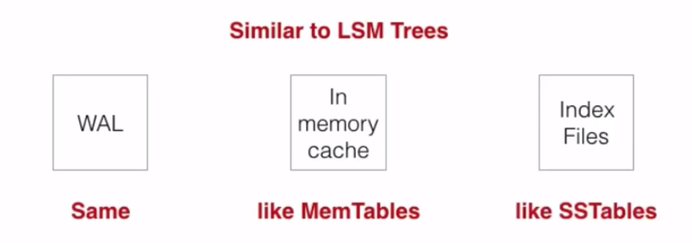

# What is time series data?
- Stock trades and quotes
- Metrics on server, application monitoring etc
- User analytics where it has user events etc
- Log data
- Sensor data
- Server monitoring based on software sensor 
# Types of time series data for influxDb
## Regular time series data

- Data produced at regular interval 
- Samples taken at regular interval
## Irregular time series data

- Events whenever they come in
- These are event driven
# Database for time series data
Following are reasons we need separate database for time series data
- Scale
- Compression
- Aging out old data
- Down sampling - collect min, max etc automatically at different window of time
- Fast range queries - get 7 days worth of data or get me one hour worth of data
# Influx Db Design 
Within influxdb there are two databases
- TSDB - Raw time series database 
- Inverted Index - inverted index for computation
## How data is stored in influxdb?

- Everything is indexed by time and series
- Organize data into shards of time, each is an underlying DB efficient to drop old data
- These are continuos block of time
## How data is represented?
```
temperature,device=dev1,building=b1 interval=80,external=18 1443782126
```
- This is called line protocol
- Text based protocol to write data into database
- Schema less i.e. simply create database, retention policy and start writing data over http protocol
- Fields Value can be string, float, integer, boolean
- Timestamp is represented as nano seconds

Following is standard for line protocol

- Measurement
- Tags
- Fields
- nano timestamp
Note: Tags are indexes, but fields values are not indexed
### Each series and fields to a unique ID
```temperature,device=dev1,building=b1#internal  >>> 1,12234234234234```
```temperature,device=dev1,building=b1#external  >>> 2,32243242343433```
### Arranging in key/values stores

- Tuples are value and timestamp

- Key spaced is ordered
## Other database has similar storage model
- leveldb
- roxdb
- hyperdb
- vuldb
None has model needed for time series data. Therefore decided to write it's own storage engine.
## History of different storage engine used by influx db
- LSM Trees - Deletes were expensive, too many open handles
- COW B+Trees - write throughput was less, missing compression
## What was need for storage engine?
- High write throughput
- Awesome read performance
- Better compression
- Write can't block read
- Read can't block write
- Write multiple ranges simultaneously 
- Hot backups 
- Many database open in single process without blowing up number of open files
## InfluxDB storage engine - Time Structured Merge Tree (TSM Tree)
This is heavily inspired by LSM, but different. Following are different concepts of TSM.

- WAL (Write ahead log)
- In memory cache
- Index Files on disk
### Data flow

### TSM File
- These are index file
- Header identify types of data
- Blocks of data - compression lives here
- Index at the end
- Footer which tells where index begin

# Query
- Looks like SQL
- It is going to change to functional query language in future
- Following is sample query
```
select percentile(90, value) from cpu
where time > now() - 12h and "region" = "west"
group by time(10m), host
```
- if doesn't have group by then it would return one result
# Inverted index
- Generally used by full text search
- In influxdb, match meta data about time series with actual series

## Index V1
- Currently on production
- in-memory
- loaded on boot
- memory constraints 
- slower boot times with high cardinality 
## Index V2
- Working on it
- Disk based index
- Does memory map between memory index and disk index
- OS handles memory mapping
# Log Entry

# Index File Layout
- Area writes once and read it. 
- Can't be updated

- Used Robin Hood hashing


